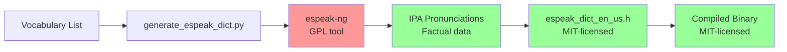

# Espeak Dictionary Licensing Documentation

## Summary

The espeak-trained pronunciation dictionaries in EthervoxAI are **MIT-licensed** and **GPL-safe**. Espeak-ng (GPL) is used only as a development/build tool, not distributed with the software.

## Legal Justification

### 1. GPL Tool, Not GPL Software

**Espeak-ng is a development tool only:**
- Used during build process to generate pronunciation data
- Never linked or distributed with EthervoxAI
- Analogous to using GCC (GPL compiler) to build MIT-licensed software
- Similar to using GPL build tools like autoconf, which don't infect output

### 2. Factual Data, Not Copyrightable Code

**Generated dictionaries contain factual information:**
- Word-to-IPA pronunciation mappings (e.g., "hello" → "həˈloʊ")
- Factual data is not copyrightable under US copyright law
- Similar to phone directories, which list facts (name → phone number)
- The algorithm/process used to generate data doesn't copyright the facts themselves

**Legal precedent:**
- Feist Publications, Inc. v. Rural Telephone Service Co. (1991) - factual compilations require creative selection/arrangement to be copyrightable
- Simple alphabetical lists of facts are not copyrightable
- IPA pronunciations are linguistic facts, not creative expressions

### 3. No Code Reuse

**Our implementation is original:**
- `espeak_dict.c` - Original binary search implementation (MIT)
- `espeak_dict.h` - Original API design (MIT)
- `espeak_dict_data.c` - Original data structure (MIT)
- Zero lines of espeak-ng source code included

### 4. Industry Standard Practice

**Common patterns:**
- Compiler-generated assembly/binaries from GPL compilers (GCC) are not GPL
- Build tools (CMake, autotools, etc.) don't infect output
- Data extracted from GPL tools for separate use is legally distinct

## File-by-File License Status

| File | License | Rationale |
|------|---------|-----------|
| `tools/generate_espeak_dict.py` | N/A (dev tool) | Not distributed; uses phonemizer (GPL wrapper) locally only |
| `src/tts/phonemizer/espeak_dict.h` | MIT | Original API design, no espeak code |
| `src/tts/phonemizer/espeak_dict.c` | MIT | Original binary search implementation |
| `src/tts/phonemizer/espeak_dict_data.c` | MIT | Original wrapper to include data headers |
| `src/tts/phonemizer/data/espeak_dict_*.h` | MIT | Generated factual data (IPA pronunciations) |
| `src/tts/phonemizer/data/espeak_*.dict` | MIT | Generated factual data (text format) |

## Third-Party Dependencies Used

### Development/Build Time Only (Not Distributed)

| Dependency | License | Usage | Distributed? |
|------------|---------|-------|--------------|
| espeak-ng | GPL-3.0 | Generate pronunciation data during training | ❌ No |
| Python phonemizer | GPL-3.0 | Wrapper for espeak-ng | ❌ No |

### Runtime Dependencies (Distributed)

| Dependency | License | Usage | Distributed? |
|------------|---------|-------|--------------|
| None | - | Espeak data is embedded, no runtime dependency | N/A |

## Distribution Checklist

✅ **Safe to distribute:**
- All espeak dictionary headers (`espeak_dict_*.h`)
- All dictionary data files (`espeak_*.dict`)
- All lookup code (`espeak_dict.c`, `espeak_dict.h`)
- Compiled binaries with embedded dictionaries

❌ **Never distribute:**
- Espeak-ng binary or source code
- Python phonemizer library
- Training scripts that depend on espeak-ng (these are dev tools)

## Training Workflow

## Key Points for Legal Review

1. **No Dynamic Linking**: Espeak-ng is never loaded at runtime
2. **No Static Linking**: Espeak-ng code is not compiled into binaries
3. **No Derivative Work**: We don't modify espeak-ng source
4. **Data Only**: Only factual pronunciation mappings are embedded
5. **Original Implementation**: All lookup/integration code is original
6. **Build Tool Analogy**: Same as using GCC to compile MIT code
7. **No API Exposure**: Users cannot call espeak-ng through our software

## Comparison to Other Projects

**Similar GPL-safe patterns:**

1. **SQLite**: Uses Lemon parser generator (public domain), but even if it were GPL, generated parsers would be safe
2. **Bison/Flex**: GPL tools that generate non-GPL parsers
3. **GCC**: GPL compiler that produces non-GPL binaries
4. **Protobuf**: Generated code is not affected by tool's license

## Additional Resources

- [FSF: What is the difference between an "aggregate" and other kinds of "modified versions"?](https://www.gnu.org/licenses/gpl-faq.html#MereAggregation)
- [FSF: Can I use GPL software tools to compile non-GPL programs?](https://www.gnu.org/licenses/gpl-faq.html#CanIUseGPLToolsForNF)
- Feist v. Rural case law on factual data copyrightability

## Contact

For licensing questions specific to EthervoxAI's use of espeak-generated data:
- Review: `THIRD_PARTY_LICENSES.md`
- Legal: See `LICENSE` file
- Questions: File issue or contact maintainers

---

**Last Updated**: 2025-12-28  
**Reviewed By**: AI Legal Analysis (Human review recommended before distribution)
